# 🏕️ Camp Ground - Full Stack Camping Site Application

<div align="center">


[](https://github.com/yourusername/camp-ground)
[](https://sonarcloud.io/dashboard?id=camp-ground)
[](https://github.com/yourusername/camp-ground)
[](https://github.com/yourusername/camp-ground)
[](LICENSE)
[](http://makeapullrequest.com)

</div>

## 🎯 Overview

**Camp Ground** is a modern, enterprise-grade full-stack web application that enables users to discover, add, and review camping sites. Built with a robust three-tier architecture and deployed using cloud-native DevOps practices, it demonstrates real-world deployment strategies across Development, Staging, and Production environments on Amazon EKS.

### ✨ Key Features
- 🔍 **Browse Campgrounds**: Advanced search and filtering by location, amenities, and ratings
- ⭐ **User Reviews**: Comprehensive review system with ratings and photo uploads
- 📝 **Site Management**: Admin panel for campground management
- 🔐 **Secure Authentication**: JWT-based authentication with role-based access control
- 📱 **Responsive Design**: Mobile-first design for seamless cross-device experience
- 🌐 **Real-time Updates**: Live notifications and real-time data synchronization

## 🏗️ Architecture

```
┌─────────────────┐    ┌─────────────────┐    ┌─────────────────┐
│   Frontend      │    │    Backend      │    │    Database     │
│   (React.js)    │◄──►│  (Node.js +     │◄──►│   (MongoDB)     │
│                 │    │   Express.js)   │    │                 │
└─────────────────┘    └─────────────────┘    └─────────────────┘
         │                       │                       │
         └───────────────────────┼───────────────────────┘
                                 │
                    ┌─────────────────┐
                    │   Load Balancer │
                    │   (AWS ALB)     │
                    └─────────────────┘
```

### 🎯 Three-Tier Architecture Components

#### 🎨 **Presentation Tier (Frontend)**
- **Technology**: React 18 with TypeScript
- **State Management**: Redux Toolkit + RTK Query
- **Styling**: Tailwind CSS with custom components
- **Build Tool**: Vite for optimized builds
- **Testing**: Jest + React Testing Library

#### ⚙️ **Application Tier (Backend)**
- **Framework**: Node.js with Express.js
- **Authentication**: JWT with refresh token rotation
- **API Design**: RESTful APIs with OpenAPI 3.0 documentation
- **Middleware**: Rate limiting, CORS, helmet security headers
- **File Storage**: AWS S3 for image uploads

#### 💾 **Data Tier (Database)**
- **Primary Database**: MongoDB with Mongoose ODM
- **Caching**: Redis for session management and caching
- **Search**: Elasticsearch for advanced search capabilities
- **Backup**: Automated daily backups to AWS S3

## 🛠️ Technology Stack

<div align="center">

### **Fullstack Technologies**


### **DevOps & Cloud**


</div>

## 🚀 Three-Tier Deployment Strategy

Our deployment strategy follows industry best practices with three distinct environments, each serving specific purposes in the software development lifecycle.

### 🛠️ **Development Environment**
- **Infrastructure**: AWS EC2 t3.medium instance
- **Purpose**: Local development and initial testing
- **Database**: Local MongoDB instance
- **Deployment**: Manual deployment via npm scripts
- **Access**: Developers only (VPN required)

```bash
Environment: Development
URL: http://dev-campground.internal:3000
Database: MongoDB (local instance)
Cache: Redis (local instance)
SSL: Self-signed certificates
```

### 🧪 **Staging Environment**
- **Infrastructure**: EKS cluster with 2 nodes (t3.small)
- **Purpose**: Integration testing, QA validation, and client demos
- **Database**: MongoDB Atlas (staging cluster)
- **Deployment**: Automated via Jenkins Pipeline 1
- **Access**: QA team, stakeholders, and developers

```bash
Environment: Staging
URL: https://staging-campground.yourdomain.com
Database: MongoDB Atlas (M10 cluster)
Cache: AWS ElastiCache Redis
SSL: Let's Encrypt certificates
Monitoring: Basic CloudWatch metrics
```

### 🏭 **Production Environment**
- **Infrastructure**: EKS cluster with 3 nodes (t3.medium) + Auto Scaling
- **Purpose**: Live application serving end users
- **Database**: MongoDB Atlas (production cluster with replica sets)
- **Deployment**: Automated via Jenkins Pipeline 2 with manual approval
- **Access**: End users and authorized administrators

```bash
Environment: Production
URL: https://campground.yourdomain.com
Database: MongoDB Atlas (M30 cluster with replica sets)
Cache: AWS ElastiCache Redis (cluster mode)
SSL: AWS Certificate Manager
Monitoring: Full observability stack (Prometheus + Grafana)
Backup: Daily automated backups
CDN: AWS CloudFront
```

### 🔄 **Environment Promotion Flow**

```
Development → Staging → Production
     ↓           ↓          ↓
   Manual     Automated   Automated
 Deployment  (Pipeline 1) (Pipeline 2)
               ↓          ↓
          Auto-triggered Manual Approval
          on PR merge   Required
```

## 🏗️ DevOps Architecture & CI/CD Pipeline

```mermaid
---
config:
  layout: dagre
---

flowchart TD
    %% 🎯 Dev Stage
    subgraph DEV_STAGE["🛠️ Dev Stage"]
        DEV["👨‍💻 Developer<br/>EC2 (t3.medium)"]
        GIT["📁 GitHub Repo"]
        DEV --> GIT
    end

    %% 🧱 CI/CD Core
    subgraph CICD["🧰 CI/CD Infrastructure"]
        JENKINS["🛠️ Jenkins<br/>EC2 (t3.large)"]
        SONAR["📊 SonarQube"]
        TRIVY["🛡️ Trivy - Image Scan"]
        GIT --> JENKINS
        JENKINS --> SONAR
        JENKINS --> TRIVY
    end

    %% 🧪 Staging Environment
    subgraph STAGE_ENV["🧪 Staging Environment"]
        STAGE_PIPE["🔁 Jenkins: Staging Pipeline"]
        ECR["📦 Push to ECR"]
        EKS_STAGE["☸️ EKS Cluster (Staging)"]
        STAGE_FE["🎨 Frontend Pod"]
        STAGE_BE["🔧 Backend Pod"]
        MONGO_STAGE["🗄️ MongoDB Atlas<br/>M10"]
        
        STAGE_PIPE --> ECR
        STAGE_PIPE --> EKS_STAGE
        EKS_STAGE --> STAGE_FE
        EKS_STAGE --> STAGE_BE
        STAGE_BE --> MONGO_STAGE
    end

    %% 🚀 Production Environment
    subgraph PROD_ENV["🏭 Production Environment"]
        PROD_PIPE["🚀 Jenkins: Production Pipeline"]
        PROD_DEPLOY["🌐 Deploy to EKS Prod (Manual Approval)"]
        EKS_PROD["☸️ EKS Cluster (Prod)<br/>3x t3.medium"]
        PROD_FE["🎨 Frontend Pods x2"]
        PROD_BE["🔧 Backend Pods x3"]
        MONGO_PROD["🗄️ MongoDB Atlas<br/>M30 RS"]
        ALB["🔗 AWS ALB"]


        PROD_PIPE --> PROD_DEPLOY
        PROD_DEPLOY --> EKS_PROD
        EKS_PROD --> PROD_FE
        EKS_PROD --> PROD_BE
        PROD_FE --> ALB
        PROD_BE --> ALB
        PROD_BE --> MONGO_PROD
    end

    %% 📦 Master Architecture Block
    subgraph ARCH["📦 Three-Tier CI/CD Architecture"]
        DEV_STAGE --> CICD --> STAGE_ENV --> PROD_ENV
    end
```



## 📋 Prerequisites

### 🛠️ **Required Software**
```bash
# Core Development Tools
Node.js >= 18.0.0
npm >= 8.0.0
Git >= 2.30.0
Docker >= 20.10.0
Docker Compose >= 2.0.0

# AWS Tools
AWS CLI v2
eksctl >= 0.147.0
kubectl >= 1.28.0
helm >= 3.12.0

# Optional but Recommended
k9s (Kubernetes CLI)
lens (Kubernetes IDE)
```

### ☁️ **AWS Prerequisites**
- AWS Account with billing enabled
- IAM user with programmatic access
- Required IAM permissions for EKS, EC2, S3, and CloudFormation
- AWS CLI configured with credentials

### 🏗️ **Infrastructure Requirements**
```yaml
Development EC2:
  Instance Type: t3.medium
  OS: Amazon Linux 2
  Storage: 30GB gp3
  Security Group: SSH (22), HTTP (3000, 5000)

Jenkins/SonarQube EC2:
  Instance Type: t3.large
  OS: Amazon Linux 2
  Storage: 50GB gp3
  Security Group: SSH (22), HTTP (8080, 9000)

EKS Staging Cluster:
  Node Type: t3.small
  Node Count: 2
  Auto Scaling: 1-3 nodes

EKS Production Cluster:
  Node Type: t3.medium
  Node Count: 3
  Auto Scaling: 2-5 nodes
```


